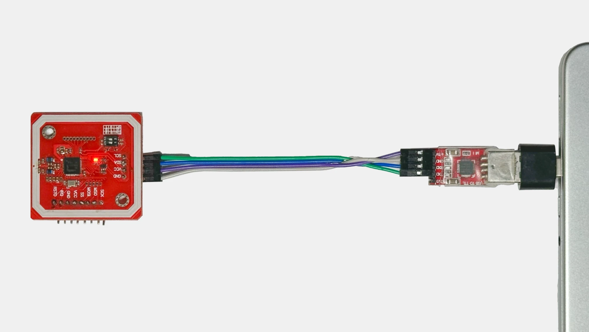

# Apple Home Key Reader

<p float="left">
  
  
</p>

# Overview

This project provides a POC of an Apple Home Key Reader implemented in Python, including:
* Fully functional Apple Home Key NFC authentication;
* NFC Express mode support;
* HAP configuration (as a virtual lock);

**Beware that this project is not targeted towards end users**, as it doesn't implement Lock device as a whole.  
Instead, it's intended for makers and experienced developers who could help create more useful and user-friendly implementations based on the example provided here.

In any case, feel free to try it out :).

# Requirements

Running this project requires the following:
* Operating system - Linux, macOS;
* Valid installation of Python 3.11 (earlier could work, untested);
* A PN532 module connected to a PC or SBC.
* Ethernet or Wi-Fi for HAP to be able to be discovered.

If using a PC, PN532 has to be connected to an UART adapter that is connected to PC in a following fashion:

<p float="left">
  
</p>


# Installation & running

Code has been tested using Python `3.11` on macOS, Linux should work too. Windows support status is unknown.  
Other OS + Python version combos were not verified but may still work.


1. (Optionally). Create and activate a venv:
    ```
    python3 -m venv ./venv

    source ./venv/bin/activate
    ```
2. Install dependencies:
    ```
    python3 -m pip install -r requirements.txt
    ```
3. Configure the application via the text editor of choice:
    ```
    nano configuration.json 
    ```
    3.1. Find NFC device port:    

        # linux
        ls /dev/*

        # macOS
        ls /dev/tty.*
    3.2. Copy the port without the `tty.` part, insert it into `port` field;  
    3.3. If you don't use a PN532, set `broadcast` to false and `driver` to appropriate value, otherwise leave as is.
3. Run application:
    ```
    python3 main.py
    ```

# Configuration

Configuration is done via a JSON file `configuration.json`, with the following 4 blocks configurable:

* `logging`:
    * level: level to log messages at. All logs related to this codebase use INFO level (20).
* `nfc`: configuration of the NFC frontend used:
    * `port`: path to serial port of the connected NFC module;
    * `driver`: nfcpy driver to use with your device. Implementation was only tested for PN532, other modules have to be verified separately (if supported by nfcpy);
    * `broadcast`: configures if to use broadcast frames and ECP, which enables express mode. If this parameter is true but used NFC device is not based on PN532, will cause an exception to be raised, set to false only if such problems occur;
* `hap`: configuration of the HAP-python library, better left unchanged;
    * `port`: network port of the virtual accessory;
    * `persist`: file to store HAP-python pairing data in.
* `homekey`:
    * `persist`: file to save endpoint and issuer configuration data in;
    * `finish`: color of the home key art to display on your device. 
       Usually, finish of the first NFC lock added to your home defines which color the keys are going to be, even if more locks are added;  
       Possible values: `black` `tan` `gold` `silver`;
    * `flow`: minimum viable digital key transaction flow do. By default reader attempts to do as least actions as possible, with fallback to next level of authentication only happening if the previous one failed. Setting this setting to `standard` or `attestation` will force protocol to fall back to those flows even if they're not required for successful auth.  
    Possible values: `fast` `standard` `attestation`.


# Project structure

Project is split into following primary modules:
- `main.py` - initialize and start all primary classes, configure device ports, etc;
- `accessory.py` - service definitions for HAP, contains no logic, with it forwarded to `service.py`;
- `service.py` - implements core application functionality, parsing HAP messages and generating responses to them, initiating NFC communication.
- `homekey.py` - homekey NFC part of the protocol implementation;  

Other modules:
- `repository.py` - implements homekey configuration state storage;
- `bfclf.py` - implementation of Broadcast frames for pn532;
- `entity.py` - entity definitions;
- `util/*` - protocol implementations, data structures, cryptography, other utility methods.

Two files will be created as the result of you running the application, assuming no settings were changed:
- `hap.state`: contains pairing data needed for HAP-python;
- `homekey.json`: contains all lock configuration data formatted in a human-readable form.


# Terminology

- EC: elliptic curve;
- HAP: Homekit Accessory Protocol, aka Network/Bluetooth part;
- Issuer: a party that enrolls endpoints. Each issuer is a person with an iCloud account;
- Endpoint: a device that's enrolled/paried to the lock;
- Enrollment: payload that contains data that was used to enroll the Endpoint to the device.  
  Can be either `hap`, meaning that the Endpoint was added via HAP, or `attestation`, meaning that endpoint was enrolled via NFC attestation flow.


# Contributing

Project is far from ideal as most of the codebase was left unchanged back from my local project that was used during the reverse-engineering process.

Therefore, there are a lot of opportunities for improvement:

* Fixing potential typos in README and code;
* Adding tests to insure stability if a refactor is made;
* Re-writing pieces of service/homekey code to reduce code size, improve readability;
* Improve logging for better protocol analysis;
* **HAP command implementations**:
  * `remove_device_credential`;
  * `get_nfc_access_control_point` - no idea what it should do;
  * Test and verify validity of other methods;
* Re-write NFC stack to improve device support.

In any case, feel free to create an issue to discuss potential improvements before starting any work (apart from fixing typos).

Codebase is formatted with default `black` and `isort` configurations, linted with `pylint`.  
Before making a contribution, verify that, they were used for best code diffs and quality;


# Notes

- This code is provided as-is. Considering the sensitive nature of authentication and security, I assume no responsibility for any issues that may arise while using this project;  
- Information is provided here for learning and DIY purposes only, usage in commercial applications is highly discouraged.
- Refrain from posting raw logs as they may contain sensitive information, such as reader private key, issuer id's and etc.
- If you find a bug, feel free to raise an issue;

# Credits

This project would have been impossible without the contributions of:
* [@kupa22](https://github.com/kupa22) - for full HAP part analysis, NFC protocol analysis;
* [@kormax](https://github.com/kormax) - ECP, NFC protocol analysis;  

Special thanks to:
* [@gm3197](https://github.com/gm3197) - for finding clues about ISO18013 being used in Home Key protocol;
* [@KhaosT](https://github.com/KhaosT/HAP-NodeJS/commit/80cdb1535f5bee874cc06657ef283ee91f258815) - for providing a demo that caused Home Key to appear in Wallet, which partially inspired me/others to go on this journey;
* @ikalchev and @bdraco for developing HAP-Python and helping with accepting in changes that were needed for this project;
* Unnamed people who gave their input on demo app improvement.

# References

* Learning material:
    - [Apple Home Key - kupa22](https://github.com/kupa22/apple-homekey) - HAP part, deriviation info;
    - [Apple Home Key - kormax](https://github.com/kormax/apple-home-key) - extra Home Key info;
    - [Enhanced Contactless Polling](https://github.com/kormax/apple-enhanced-contactless-polling) - Broadcast Frames, ECP.
